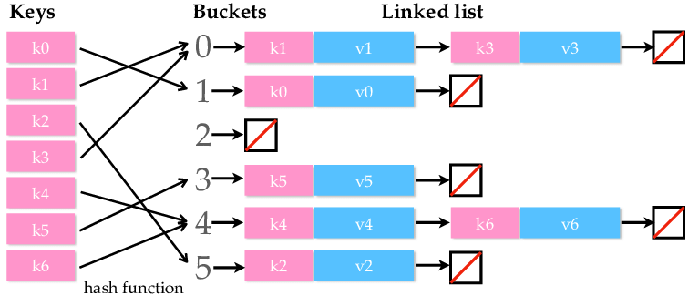

# Лабораторная работа №2

## Цель работы

Цель: освоиться с построением пользовательских типов данных, полиморфизмом, рекурсивными алгоритмами и средствами тестирования (unit testing, property-based testing).

В рамках лабораторной работы вам предлагается реализовать одну из предложенных классических структур данных (список, дерево, бинарное дерево, hashmap, граф...).

## Вариант

**HashMap Separate Chain**

## Реализация

- [Исходный код](lib/hashmap.ex)
- [Тесты](test/hashmap_test.exs)

### Особенности реализации

- Добавлены аннотации типов, подключен dialyzer.
- Не используется сахар из модулей Enum и List.
- При инициализации количество бакетов равно нулю. Они создаются только при получении нового хэша.
- Переопределена операция сравнения, чтобы не поддерживать сортировку элементов внутри бакетов.
- Правая свертка не была реализована. Не увидел в этой операции никакого смысла. На прикладном уровне это Unordered Dict.
- Доказательство того, что структура является монодом, делается с помощью нескольких тестов:
  - Коммутативность операций. Порядок выполнения одинаковых операций (put, remove) не влияет на итоговое состояние.
  - Идемпотентность. Если тысячу раз добавить один и тот же элемент, то хэшмапа не поменяется.
  - Нейтральность. Сложение хэшмапы с пустой хэшмапой дает исходную хэшмапу.

## Выводы

Мне было больно делать эту лабораторную работу, так как асимптотическая сложность данной HashMap'ы оставляет желать лучшего. Из-за того, что все построено на связных списках, все операции выполняются за O(N). 

Отсутствие индексации убивает весь смысл хэш-таблиц.

Тем не менее, в процессе работы ознакомился с некоторым количеством проектов, откуда я почерпнул несколько интересных фишек Elixir, например, использование `struct`, `__MODULE__` и функций без тела. 

А также поработал со списками без использования Enum и List, это необычный опыт.
